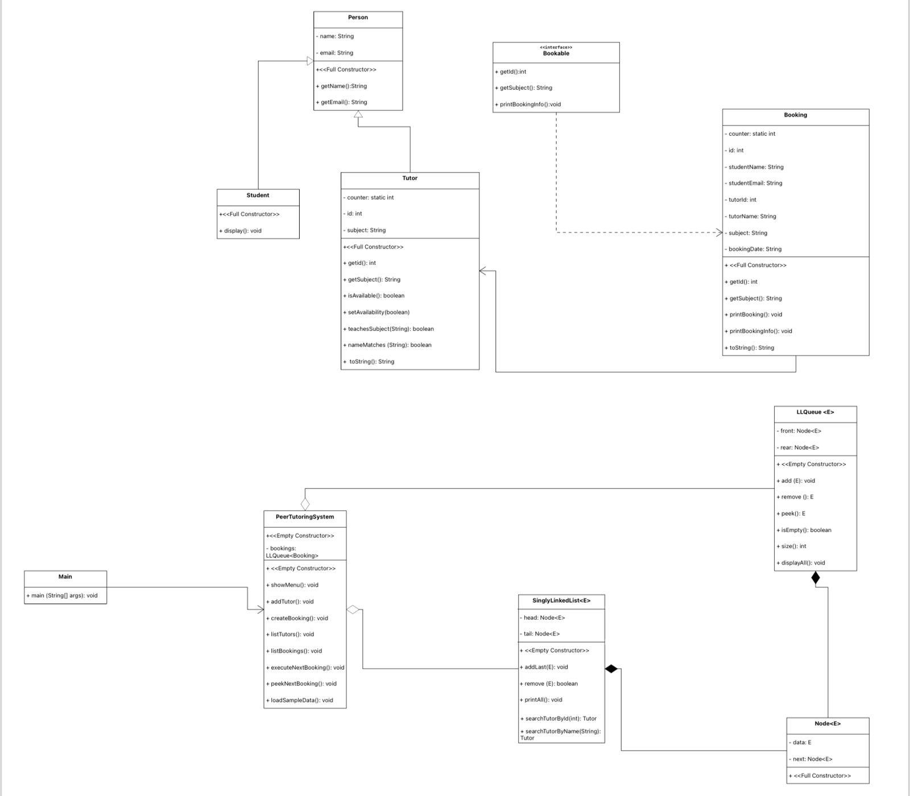

# Peer Tutoring System – Data Structures (Java)

# Overview
This repository contains a group academic project developed as part of a Data Structures course.
The project implements a simple Peer Tutoring System using a menu-based command-line interface (CLI), focusing on applying fundamental data structures and object-oriented programming concepts.

# Features
- Add tutors with basic information (name, email, subject)
- Create tutoring bookings (student information, tutor ID, date, and time)
- Display all tutors
- Display all bookings
- Execute the next booking using FIFO order
- Peek at the next booking without removing it

# Data Structures and Concepts
- Singly Linked List (custom implementation) for managing tutors
- Queue implemented using a linked list for managing bookings in FIFO order
- Basic searching and traversal operations
- Object-Oriented Programming principles (classes, encapsulation, constructors)

## IMPORTANT NOTE
This project was completed as a group academic project as part of university coursework.

### UML Class Diagram

